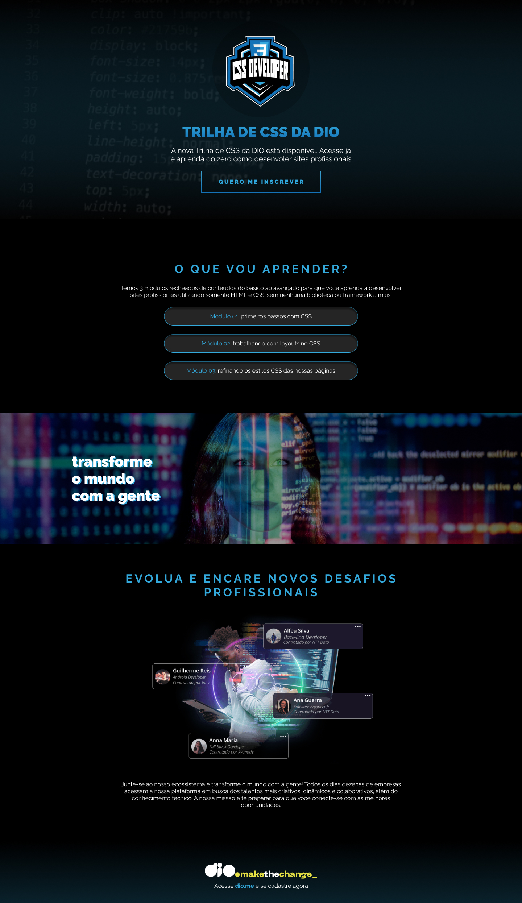

<h1 align="center"> Desafio 3 - DIO </h1>

Esse site foi desenvolvido como parte de um desafio elaborado pela DIO no Bootcamp de "Primeiros passos em Tecnologia"

  <a href="#-tecnologias">Tecnologias</a>&nbsp;&nbsp;&nbsp;|&nbsp;&nbsp;&nbsp;
  <a href="#-projeto">Projeto</a>&nbsp;&nbsp;&nbsp;|&nbsp;&nbsp;&nbsp;
  <a href="#memo-licença">Licença</a>

  

 

  

## 🚀 Tecnologias

Esse projeto foi desenvolvido com as seguintes tecnologias:

- HTML e CSS
- Git e Github
- Figma

## 💻 Projeto

Este projeto é uma página inicial perfeita para um site de anúncio de curso.

- [Visite o projeto online](https://luad3cristal.github.io/dio3)

## 📝 Licença

Esse projeto está sob a licença MIT.